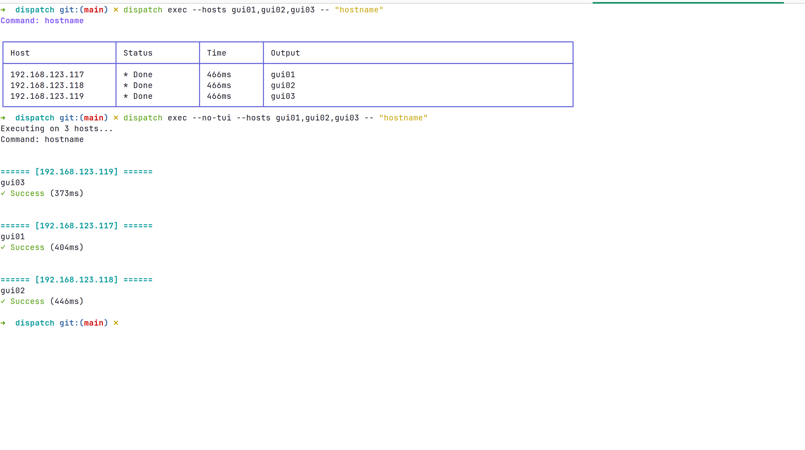
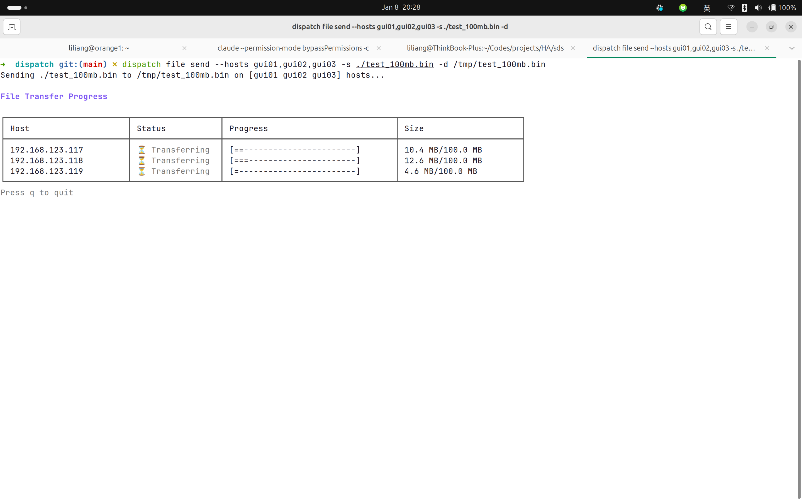
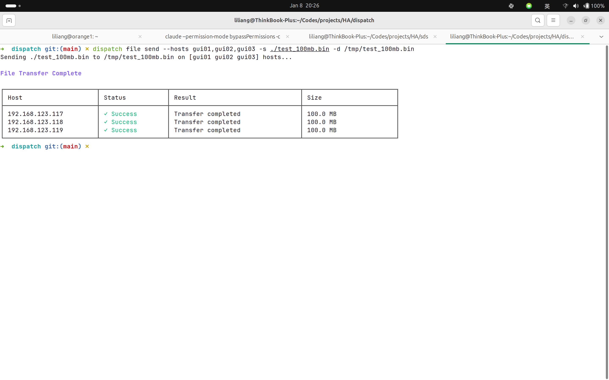

# dispatch

一个简单的 SSH 批量操作工具，用于在多台服务器上执行命令和管理文件。

> Ansible 太复杂？只需要在多台机器上运行命令和复制文件？使用 dispatch。

[English](README.md) | 中文

## 功能特性

- **批量命令执行** - 同时在多台主机上执行 Shell 命令
- **文件操作** - 发送、获取、更新和删除远程文件
- **TUI 模式** - 可视化表格界面进行多主机操作
- **实时输出** - 流式输出适合长时间运行的命令
- **主机密钥验证** - SSH known_hosts 支持自动添加模式
- **连接复用** - 操作内的高效连接处理
- **配置优先级** - TOML 配置 > ~/.ssh/config > /etc/hosts
- **SSH Agent 支持** - 自动认证方式回退
- **主机分组** - 将主机组织成组进行批量操作
- **并行执行** - 可配置的并发控制
- **彩色日志** - Debug、info、warn、error 级别，可选时间戳

## 安装

```bash
go install github.com/liliang-cn/dispatch/cmd/dispatch@latest
```

或从源码构建：

```bash
git clone https://github.com/liliang-cn/dispatch
cd dispatch
make build
sudo mv bin/dispatch /usr/local/bin/
```

## 配置

配置文件位置：`~/.dispatch/config.toml`

### 快速示例

```toml
[ssh]
user = "root"
port = 22
key_path = "~/.ssh/id_rsa"

[hosts.web]
addresses = ["192.168.1.10", "192.168.1.11"]
user = "www-data"
```

### 完整配置参考

```toml
# ============================================
# SSH 默认设置
# ============================================
[ssh]
user           = "root"              # 默认 SSH 用户
port           = 22                  # 默认 SSH 端口
key_path       = "~/.ssh/id_rsa"     # 默认私钥路径
timeout        = "30s"               # 连接超时
known_hosts    = "~/.ssh/known_hosts" # 主机密钥验证（空 = 禁用）
strict_host_key = false              # true = 拒绝未知主机，false = 自动添加

# ============================================
# 执行设置
# ============================================
[exec]
parallel = 10        # 默认并行连接数（默认值：10）
timeout  = "5m"      # 命令超时（默认值：5 分钟）
shell    = "/bin/bash" # 远程 Shell（默认值：/bin/bash）

# ============================================
# 日志设置
# ============================================
[log]
level     = "info"   # debug, info, warn, error（默认值：info）
output    = "stdout" # stdout, stderr，或文件路径
no_color  = false    # 禁用彩色输出（默认值：false）
show_time = false    # 显示时间戳（默认值：false）

# ============================================
# 主机分组
# ============================================
# 多主机同一用户的组
[hosts.web]
addresses = ["192.168.1.10", "192.168.1.11", "192.168.1.12"]
user      = "www-data"   # 为该组覆盖默认用户
port      = 22           # 覆盖默认端口（可选）
key_path  = "~/.ssh/web_key" # 覆盖默认密钥（可选）

# 使用默认设置的组
[hosts.db]
addresses = ["192.168.1.20", "192.168.1.21"]

# 单个主机（用于单个主机覆盖）
[hosts.api-server]
addresses = ["192.168.1.100"]
user      = "api"
key_path  = "~/.ssh/api_key"
port      = 2222
```

### 单主机配置

你可以为不同主机配置不同的用户、端口或密钥：

```toml
[ssh]
user = "root"
key_path = "~/.ssh/id_rsa"

# Web 服务器使用不同用户
[hosts.web]
addresses = ["web1", "web2", "web3"]
user = "www-data"
port = 22

# 数据库服务器使用不同用户和密钥
[hosts.db]
addresses = ["db1", "db2"]
user = "dbadmin"
key_path = "~/.ssh/db_key"

# 覆盖组内的特定主机
[hosts.web1]
user = "admin"      # 覆盖组的用户
key_path = "~/.ssh/admin_key"
```

### 使用 SSH 别名

你可以使用 SSH 配置别名作为地址：

```toml
# 假设 ~/.ssh/config 有：
# Host gui01
#     HostName 192.168.123.117
#     User ubuntu

[hosts.gui]
addresses = ["gui01", "gui02", "gui03"]
# user 会从 ~/.ssh/config 读取
```

### 通配符支持

使用通配符匹配 SSH 配置中的主机：

```bash
# 匹配所有以 "gui" 开头的主机
dispatch exec --hosts "gui*" -- "uptime"

# 匹配所有以 "web" 开头的主机
dispatch exec --hosts "web*" -- "systemctl status nginx"
```

### 配置优先级

当多个源定义主机的设置时，dispatch 使用以下优先级（从高到低）：

1. **TOML 主机级** - `[hosts.hostname]`（最高）
2. **TOML 组级** - `[hosts.groupname]`
3. **~/.ssh/config** - SSH 配置文件
4. **默认值** - 来自 `[ssh]` 部分（最低）

示例：

```toml
[ssh]
user = "root"          # 默认用户
port = 22              # 默认端口

[hosts.web]
addresses = ["web1", "web2"]
user = "www-data"      # 组覆盖

[hosts.web1]
user = "admin"         # 主机覆盖（最高优先级）
```

对于 `web1`：
- 用户：`admin`（来自主机级）
- 端口：`22`（来自默认）

对于 `web2`：
- 用户：`www-data`（来自组级）
- 端口：`22`（来自默认）

## 使用方法

### 执行命令

```bash
# 在主机组上执行（多主机使用 TUI 模式）
dispatch exec --hosts web -- "uptime"

# 在多个主机上执行
dispatch exec --hosts "host1,host2" -- "systemctl status nginx"

# 使用文本模式而非 TUI
dispatch exec --hosts web --no-tui -- "apt-get install nginx"

# 执行交互式命令（注入 stdin）
dispatch exec --hosts web --input "y\n" -- "./interactive_script.sh"

# 设置并行数和超时
dispatch exec --hosts web -p 5 -t 60 -- "df -h"
```

### 文件操作

```bash
# 发送文件到多个主机（显示进度）
dispatch file send -s ./nginx.conf -d /etc/nginx/nginx.conf --hosts web

# 发送并设置权限和备份现有文件
dispatch file send -s app.conf -d /etc/app/app.conf --hosts web --mode 644 --backup

# 使用文本模式而非 TUI
dispatch file send -s ./app.conf -d /etc/app/app.conf --hosts web --no-tui

# 从多个主机获取文件
dispatch file get -s /var/log/app.log -d ./logs/ --hosts web

# 更新文件（仅在更改时复制）
dispatch file update -s nginx.conf -d /etc/nginx/nginx.conf --hosts web --backup

# 删除远程文件
dispatch file delete --path /tmp/old.log --hosts web

# 检查文件信息（大小、模式、所有者等）- 使用 TUI 模式
dispatch file stats --path /etc/nginx/nginx.conf --hosts web

# 读取远程主机上的文本文件内容
dispatch file read --path /var/log/app.log --hosts web

# 读取时使用偏移和限制（用于分页）
dispatch file read --path /var/log/app.log --hosts web --offset 1000 --limit 500
```

### 其他命令

```bash
# 列出所有主机和组
dispatch hosts
```

## 全局选项

| 标志 | 描述 |
|------|------|
| `-c, --config` | 配置文件路径（默认值：`~/.dispatch/config.toml`） |
| `-p, --parallel` | 并行连接数（默认值：来自配置） |
| `-t, --timeout` | 超时秒数（默认值：来自配置） |
| `--log-level` | 日志级别：debug, info, warn, error |
| `--no-tui` | 禁用 TUI 模式，使用文本输出 |

### TUI 模式

在多主机上操作时，dispatch 自动使用 TUI（终端 UI）模式：

- **exec**：在表格中显示实时命令执行状态
- **file send/get/update**：显示文件传输进度
- **file stats**：在表格中显示文件信息（大小、模式、所有者等）

#### exec 命令



#### file send 命令





禁用 TUI 使用纯文本输出，添加 `--no-tui`：

```bash
dispatch exec --hosts web --no-tui -- "uptime"
dispatch file send -s file.txt -d /tmp/file.txt --hosts web --no-tui
dispatch file stats --path /etc/hosts --hosts web --no-tui
```

## 认证

dispatch 支持多种认证方式，自动回退：

1. **ssh-agent** - 如果设置了 `SSH_AUTH_SOCK` 则优先尝试
2. **指定密钥** - 来自 TOML 配置或 `--key` 选项的密钥
3. **默认密钥** - 从 `~/.ssh/` 尝试 `id_rsa`、`id_ed25519`、`id_ecdsa` 等

### 使用 ~/.ssh/config

dispatch 自动读取你的 SSH 配置：

```ssh
# ~/.ssh/config
Host production
    HostName 192.168.1.100
    User deploy
    Port 2222
    IdentityFile ~/.ssh/deploy_key
```

```bash
# 使用 SSH 配置中的别名
dispatch exec --hosts production -- "uname -a"
```

### 使用 /etc/hosts

如果 DNS 解析失败，dispatch 回退到 `/etc/hosts`：

```
# /etc/hosts
192.168.1.10  web1
192.168.1.11  web2
192.168.1.12  web3
```

## Go 库使用

```go
package main

import (
    "context"
    "fmt"
    "time"

    "github.com/liliang-cn/dispatch/pkg/dispatch"
)

func main() {
    // 使用默认配置创建客户端
    client, _ := dispatch.New(nil)

    ctx := context.Background()

    // 在多个主机上执行命令
    result, _ := client.Exec(ctx, []string{"web"}, "uname -a",
        dispatch.WithParallel(5),
        dispatch.WithTimeout(30*time.Second),
    )

    // 使用输入执行交互式命令
    client.Exec(ctx, []string{"web"}, "./script.sh",
        dispatch.WithInput("y\n"),
    )

    for _, r := range result.Hosts {
        if r.Success {
            fmt.Printf("[%s] %s\n", r.Host, r.Output)
        }
    }
}
```

### 文件操作

```go
// 发送文件到多个主机并备份
copyResult, _ := client.Copy(ctx, []string{"web"}, "./app.conf", "/etc/app/app.conf",
    dispatch.WithCopyMode(0644),
    dispatch.WithParallel(5),
    dispatch.WithBackup(true),
)

// 从多个主机获取文件
fetchResult, _ := client.Fetch(ctx, []string{"web"}, "/var/log/app.log", "./logs/")

// 更新文件（仅在更改时复制）并备份
updateResult, _ := client.Update(ctx, []string{"web"}, "./app.conf", "/etc/app/app.conf",
    dispatch.WithUpdateBackup(true),
)

// 获取文件信息（大小、模式、所有者、组、修改时间）
statsResult, _ := client.Stats(ctx, []string{"web"}, "/etc/nginx/nginx.conf",
    dispatch.WithStatsParallel(5),
)

// 读取远程主机上的文本文件内容
readResult, _ := client.Read(ctx, []string{"web"}, "/var/log/app.log",
    dispatch.WithReadParallel(5),
    dispatch.WithReadOffset(1000),  // 可选：从字节偏移开始读取
    dispatch.WithReadLimit(500),    // 可选：限制读取的字节数
)
```

## 项目结构

```
dispatch/
├── cmd/
│   └── dispatch/          # CLI 应用程序
├── pkg/
│   ├── dispatch/          # 高层客户端 API
│   ├── executor/          # 并行执行引擎
│   ├── inventory/         # TOML 配置和主机管理
│   ├── logger/            # 彩色日志
│   ├── ssh/               # 带主机密钥验证的 SSH 客户端
│   └── tui/               # 终端 UI 组件
└── config/
    └── example.toml       # 示例配置
```

## 与 Ansible 对比

| 特性 | Ansible | dispatch |
|------|---------|----------|
| 学习曲线 | 陡峭 | 平缓 |
| 配置格式 | YAML Playbooks | TOML |
| 执行 | 模块 | 直接命令 |
| 集成 | CLI/Python | Go 库/CLI |
| 适用场景 | 完整自动化 | 日常运维/Go 集成 |
| 实时输出 | 有限 | 支持（TUI 模式） |
| 主机密钥验证 | 支持 | 支持（known_hosts） |

## 许可证

MIT
